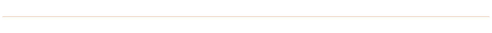
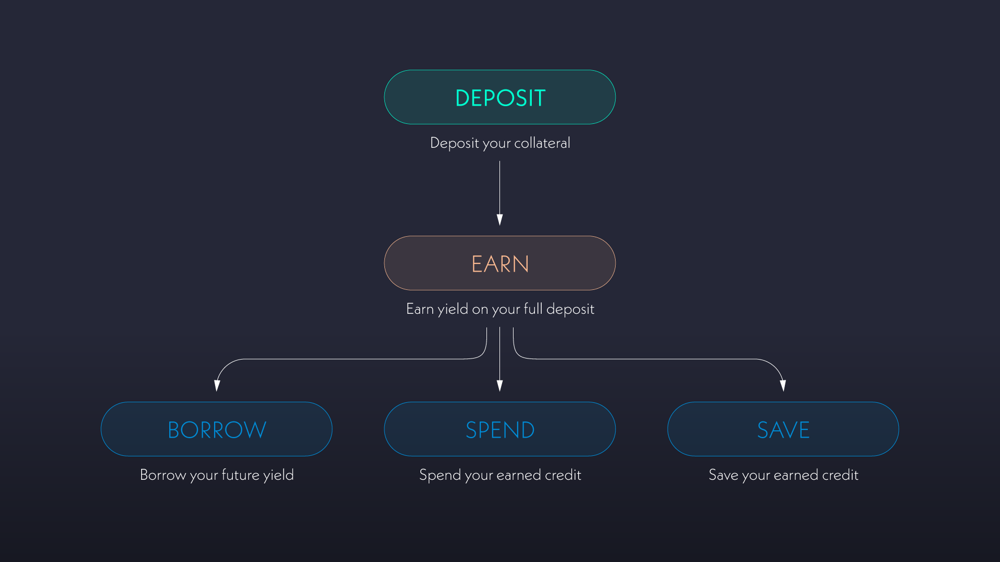

# 📜 Alchemix

Alchemix lets you instantly access loans representing your collateral's future yield. Over time, the interest your deposit earns is used to repay your debt automatically. Alchemix loans are self-repaying, interest-free, and non-liquidating.

> _**Alchemix gives you DeFi loans that transform future yield into present-day capital.**_

Explore Alchemix's diverse collateral strategies to find the best self-repaying loan for you on our [main website](https://alchemix.fi/).

## **The Benefits of Alchemix**

* **Maximize Your Assets:** Maintain exposure to your yield-bearing assets while accessing immediate value—spend your future yield today.
* **Diverse Collateral Strategies:** Complete flexibility to choose between any integrated yield strategies.
* **No Forced Liquidations:** Your loan can't be forcibly closed by anyone, not even the protocol. You can self-liquidate anytime by repaying your debt with your collateral.
* **Complete Freedom:** Your position remains accessible at all times, with no locking or deposit/withdrawal fees. You can repay your debt whenever you choose or let it repay itself over time.

<figure><figcaption></figcaption></figure>

## **Get Your First Self-Repaying Loan**

* [Watch the Alchemix cinematic ad](https://www.youtube.com/embed/FlWP9FC8C3c?autoplay=1)
* [Borrow using Alchemix](https://alchemix.fi/)

## Quick Start Guide

1. **Deposit to Earn & Borrow**\
   Deposit your collateral into your preferred yield strategy to start earning interest, and be able to take out a loan. Use your deposit to borrow and receive alAssets while your deposit earns interest.
2. **Swap alAsset**\
   Swap the alAsset to any other token via a DEX or DEX Aggregator to access the value of your loan. alAssets can also be used directly on some DeFi protocols.
3. **Wait, Withdraw, Borrow, Repay, or Self-Liquidate**\
   Your chosen yield strategy will earn interest on the full initial deposit. When the chosen strategy earns yield, your share of the yield is used to repay your debt over time automatically. Manage your loan as needed, with the flexibility to withdraw principal, borrow more, repay, or self-liquidate at any time.

<figure><figcaption>
<strong>The Alchemist Flow.</strong> Deposit your collateral to Alchemix to earn credit, borrow synthetic assets to spend, or save your capital and let your credit accrue.
</figcaption></figure>

<figure><figcaption>
<strong>Alchemix Collateral.</strong> These are the types of underlying collateral assets that Alchemix supports. Alchemix offers a diverse selection of yield strategies for each underlying asset.
</figcaption></figure>

## Learn more

> * [guides](resources/guides/ "mention")
> * [how-to](resources/how-to/ "mention")

<figure><figcaption></figcaption></figure>
