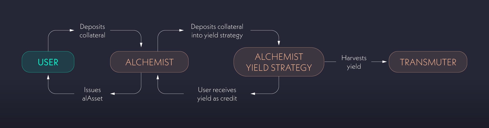

# ⚗️ Alchemist

The Alchemists are the core smart contracts responsible for managing user accounts in Alchemix. They are used for various reasons, including depositing tokens, minting synthetic assets (alAssets), withdrawing tokens, engaging in yield farming strategies, and repaying debt.

Alchemist contracts primarily manage the yield strategies and then distribute the harvested yield to depositors. Whenever users deposit funds they can use those deposits to take out a loan via minting alAssets.

alAssets have several uses, such as exchanging them for other tokens in markets or using them in various DeFi protocols. Users also have the freedom to repay their debt using underlying tokens or alAssets.

Alchemists can have multiple yield strategies but can only issue one type of alAsset. For example, the alUSD Alchemist issues alUSD but can accept yield-bearing tokens for any approved stablecoin.

<figure><figcaption>
The Alchemist contracts utilize your deposits to harvest yield from deposits.
</figcaption></figure>


Each alAsset on each chain is managed by a dedicated Alchemist. Learn more about this here: [alchemix-on-l2.md](alchemix-on-l2.md "mention")


## Key Features

### **Diverse Yield Farming Strategies**

Alchemists accept yield-bearing assets as collateral but also can accept underlying tokens as deposits, which are converted to third-party yield tokens and then deposited. Alchemix accepts different collateral types, such as ETH-denominated tokens and stablecoins.

### **Minting**

Users can mint alAssets by depositing collateral, effectively taking out a loan. Minting alAssets increases your debt by a corresponding amount, equivalent to borrowing against your deposited collateral.

### **Flexible Withdrawals**

Users can withdraw their original underlying assets, subject to certain limitations.

Withdrawals are limited by the minimum collateral-to-debt ratio (2:1, collateral must be at least twice the debt). Collateral withdrawals are not allowed if they cause the collateral-to-debt ratio to fall below the required minimum, ensuring system solvency and protection against defaults.

To withdraw collateral after taking out a loan, users must either:

* **Repay the Debt**: You can repay your debt by depositing alAssets (alUSD or alETH) or repaying with the associated underlying asset (stablecoin or ETH). Repaying debt with alAssets effectively burns the tokens which in turn eliminates the debt.
* **Wait for Yield**: The yield harvests generated by the deposited assets can reduce the debt over time. This debt reduction either allows you to take out a loan or, if you choose not to, enables you to withdraw additional collateral.
* **Self-Liquidation:** The deposited collateral can be used to repay the debt, provided the collateral-to-debt ratio (2:1) is maintained. This process involves using a portion of your collateral to settle the debt.

<figure><figcaption></figcaption></figure>

## How it works

Below is an example of how it works with the stablecoin DAI and the Alchemix synthetic stablecoin, alUSD, using the Yearn Finance DAI yVault vault. The system works the same for other accepted stablecoins, as well as ETH-denominated yield strategies:

1. **Depositing Assets:** Users can deposit a range of yield-bearing assets or their underlying counterparts. If the underlying asset is deposited, the protocol will convert it to the yield-bearing asset on behalf of the user before depositing it into Alchemix.
   * **Example:** If the user deposits DAI, the Alchemist will first convert the DAI into yvDAI through Yearn Finance and then accept the deposit.
2. **Earning & Borrowing:** Users take loans in synthetic alAssets: alETH can be borrowed against ETH-denominated yield token deposits, and alUSD can be borrowed against stablecoin-denominated yield token deposits. Users can borrow alAssets for up to 50% of the collateral's quantity (a minimum collateral-to-debt ratio of 2:1).&#x20;
   * **Example:** The user borrows alUSD worth up to 50% of the amount of deposited collateral. Loans require a minimum collateralization ratio of 200%. For every 2 DAI a user deposits, they may borrow up to 1 alUSD.
3. **Yield Harvesting:** The user deposits are placed in a yield strategy and the accrued yield from your collateral contributes to repaying the borrowed amount. Each yield harvest reduces your debt, and this also causes an increase in your borrowing capacity.&#x20;
   * **Example:** The yield that accrues to the yvDAI is periodically harvested to repay the debt of the depositors. With each harvest, the user's account is credited a proportional share of the harvest, thus reducing the user's debt. If you have deposited DAI, but have not borrowed alUSD, the harvest will increase your alUSD borrow limit.
4. **Debt Management & Repayment:** Users can repay their debt at any time, using the alAsset or underlying assets. As the protocol pays down the user's debt, the user can withdraw increasing amounts of DAI from the Alchemist or re-up their alUSD loan while maintaining a minimum 200% collateral ratio.  Users can buy alAssets from the open market and pay off their debt at a discount. alAssets and the underlying tokens are treated as 1:1 by the Alchemist for repayment and self-liquidation.&#x20;
   * **Example:** alUSD debt can be repaid with alUSD, DAI, USDC, and USDT. Repaying debt with alUSD is also a price-restoring mechanism because when the alUSD price is under $1, users can buy it from AMMs and pay off their debt at a discount.
5. **Self-Liquidation:** If users do not have the capital to repay their loan, they can self-liquidate. Self-liquidation will use a user's collateral to repay outstanding debt, at which point the user can withdraw all remaining collateral.
   * **Example:** Users can self-liquidate a portion or all of their collateral whenever needed. The contract will repay their alUSD debt using the DAI from their yvDAI collateral.
6. **Harvesting Fees:** As yield is harvested, it is transferred to the [Transmuter](https://alchemix-finance.gitbook.io/user-docs/alchemix-ecosystem/transmuter) contract from the Alchemist contracts. Alchemix charges a fee of 10% of all generated yield, which means that 90% of the interest your position earns will pay down your debt, or increase your debt allowance if you have no debt.&#x20;

The Alchemists give users a flexible line of credit for their future yield. Users can enter and exit anytime without committing to long lockups. A user's collateral will never be liquidated unless they do it themselves, because their debt can only go down.

Alchemix has undergone multiple [audits](https://alchemix-finance.gitbook.io/user-docs/resources/audits-and-reports), hosts an ongoing [bug bounty program](https://immunefi.com/bounty/alchemix/), and utilizes internal security reviews and risk monitoring tools.

### **To protect deposits, Alchemists incorporate:**

* **Collateral Deposit Cap:** To limit the supply of alAssets and exposure to any single yield source, the amount of each collateral type used to mint alAssets is capped.
* **Operational Safeguards**: With Maximum Loss, Repay Cap, and Liquidate Cap limits, the protocol guards against instability from market fluctuations.
  * **Maximum Loss:** The maximum loss parameter limits how much a yield strategy can lose. If exceeded, the yield strategy is automatically paused for evaluation. See[ multisig admin rights ](../alchemix-dao/the-alchemix-dao/governance-process/multisig-admin-rights.md)for more information.
  * **Repay and Liquidate Caps:** Time-bound limits that manage the quantity of debt that can be repaid and the amount of collateral that can be liquidated, limiting damage of any potential exploits.


For detailed information about this topic, see [Vault Losses and Collateral De-pegging](../resources/guides/vault-losses-and-collateral-de-pegging.md).


<figure><figcaption></figcaption></figure>
